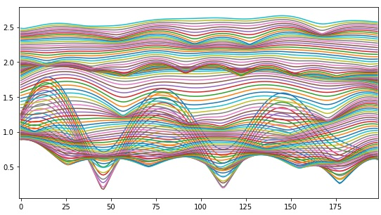

<!--
You can use HTML elements in Markdown, such as the comment element, and they won't
be affected by a markdown parser. However, if you create an HTML element in your
markdown file, you cannot use markdown syntax within that element's contents.
-->

<!--

  

 <strong> Page is being updated ...untill then please refere to  the  <a href="https://spkit.readthedocs.io/en/latest/">Documentation</a></strong>

-->

  

  <h3><a href="examples/#ITC">Information Theory</a></h3>
  
Entropy for real valued signal, such as EEG

  
  

  

  <h3><a href="examples/#wavelet">Wavelet Analysis</a></h3>
  
Comtinues and Discrete Wavelet transform, Wavelet packet decomposition

  
  

  

  <h3><a href="examples/#ML">Machine Learning</a></h3>
  
 Basic machine learning models with better visualization. Naive Bayes, Logistic Regression, Decision Trees, MLP, and Kernel Learning

  
  

  

  <h3><a href="examples/#A&S">Transform Techniques</a></h3>
  
Transform techniques not widely available such as Fractional Fourier Transform, DCT, PCA, ICA, Signal decomposition models

  
  

  

  <h3><a href="examples/#EEG">Biomedical Signals</a></h3>
  
Signal Processing techniques specifically for biomedical signals such as EEG, GSR, ECG. Artifact removal techniques

  
  

  

  <h3><a href="examples/index.html">Misc</a></h3>
  
Other miscellaneous algorithms such as LFSR

  
  

<!-- 

 -->

<!--

  

 <strong> Check <a href="https://spkit.github.io/guide" target="_blank">New Guide for documentation here</a></strong>

-->
